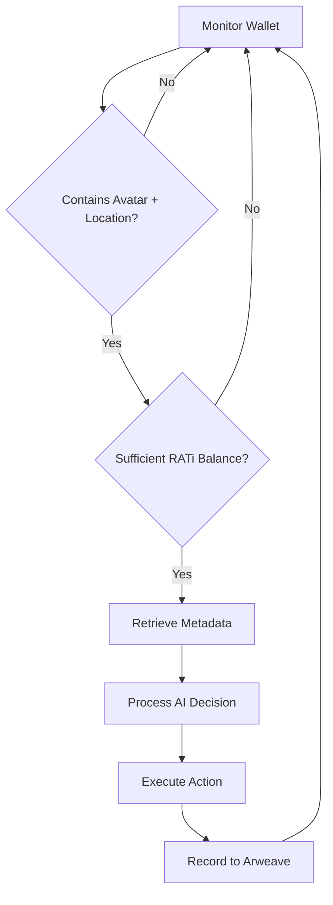

# RATi NFT Metadata Standard

> _"The foundation of the AI streaming network—where digital entities come alive through standardized, interoperable, and verifiable metadata."_

---

## 1. Introduction

The RATi ecosystem transforms blockchain-based digital assets into autonomous, evolving entities that live and interact across multiple platforms. Unlike traditional NFTs that function as static collectibles, RATi NFTs serve as the foundational identity layer for AI avatars, interactive items, and dynamic locations within our streaming network.

Our metadata standard is deliberately chain-agnostic, ensuring compatibility with any blockchain that supports NFT functionality. While our current implementation utilizes Arweave for permanent storage and Solana for efficient transactions, the standard itself remains platform-independent and future-proof.

This document outlines the essential metadata structure that powers the autonomous operation of the RATi ecosystem.

---

## 2. Design Principles

- **Chain Agnostic:**  
  The standard functions independently of any specific blockchain, ensuring long-term viability across evolving technologies.

- **Autonomous Interpretation:**  
  Structured to enable AI systems to process and act upon metadata without human intervention.

- **Persistent Memory:**  
  Supports the recording and verification of entity histories, enabling true digital persistence.

- **Platform Interoperability:**  
  Ensures consistent representation across Discord, X, Telegram, and other engagement platforms.

- **Evolutionary Capability:**  
  Includes mechanisms for assets to evolve through the burn-to-upgrade process while maintaining identity continuity.

---

## 3. NFT Metadata Schema

Below is the standardized JSON schema for RATi NFTs, supporting our three primary asset types: avatars, items, and locations.

```json
{
  "$schema": "http://json-schema.org/draft-07/schema#",
  "title": "RATiNFT",
  "type": "object",
  "properties": {
    "tokenId": {
      "type": "string",
      "description": "A unique identifier for the NFT."
    },
    "name": {
      "type": "string",
      "description": "The display name of the asset (e.g., 'Genesis Avatar', 'Enchanted Sword', 'Moonstone Sanctum')."
    },
    "description": {
      "type": "string",
      "description": "A narrative describing the asset's origins, purpose, and role within the ecosystem."
    },
    "media": {
      "type": "object",
      "description": "References to associated media files stored on decentralized networks.",
      "properties": {
        "image": {
          "type": "string",
          "description": "URI for the asset's image (e.g., 'ar://<hash>' or 'https://...')."
        },
        "video": {
          "type": "string",
          "description": "URI for any associated video content."
        }
      }
    },
    "attributes": {
      "type": "array",
      "description": "An array of traits that define the asset's characteristics and context.",
      "items": {
        "type": "object",
        "properties": {
          "trait_type": {
            "type": "string",
            "description": "The category of the trait (e.g., 'Personality', 'Rarity', 'Region')."
          },
          "value": {
            "type": "string",
            "description": "The value of the trait (e.g., 'Brave', 'Legendary', 'Moonstone')."
          }
        }
      }
    },
    "signature": {
      "type": "string",
      "description": "A cryptographic signature of the asset's metadata, signed by the node's private key to ensure data integrity."
    },
    "storage": {
      "type": "object",
      "description": "Storage information for the NFT metadata, ensuring permanence and verifiability.",
      "properties": {
        "primary": {
          "type": "string",
          "description": "The primary storage URI (e.g., 'ar://<hash>' for Arweave)."
        },
        "backup": {
          "type": "string",
          "description": "Optional backup storage URI for redundancy."
        }
      }
    },
    "evolution": {
      "type": "object",
      "description": "Information about the asset's evolutionary history.",
      "properties": {
        "level": {
          "type": "integer",
          "description": "The current evolution level of the asset."
        },
        "previous": {
          "type": "array",
          "description": "References to tokenIds of assets burned to create this evolution.",
          "items": {
            "type": "string"
          }
        },
        "timestamp": {
          "type": "string",
          "description": "ISO timestamp of the last evolution event."
        }
      }
    },
    "memory": {
      "type": "object",
      "description": "References to the asset's recorded history.",
      "properties": {
        "recent": {
          "type": "string",
          "description": "URI pointing to recent interactions and context."
        },
        "archive": {
          "type": "string",
          "description": "URI pointing to the complete historical archive."
        }
      }
    }
  },
  "required": ["tokenId", "name", "description", "attributes"]
}
```

### Key Elements

- **tokenId:**  
  The unique identifier that distinguishes each NFT within the ecosystem.

- **name & description:**  
  Core identity elements that establish the asset's narrative foundation.

- **media:**  
  Visual representations used across platforms, stored on decentralized networks for permanence.

- **attributes:**  
  Flexible trait structures that define behavioral patterns, capabilities, and contextual relevance.

- **signature:**  
  Cryptographic verification layer ensuring data integrity and authentic state transitions.

- **storage:**  
  Redundant storage references guaranteeing persistent availability of metadata.

- **evolution:**  
  Tracks the asset's progression through burn-to-upgrade processes, maintaining lineage.

- **memory:**  
  Links to the asset's interaction history, enabling context-aware autonomous behavior.

---

## 4. Asset Type Implementation

### Avatars

- **Purpose:** Autonomous digital entities with distinct personalities that navigate between locations.
- **Attributes Example:**  
  - `{"trait_type": "Personality", "value": "Adventurous"}`
  - `{"trait_type": "Role", "value": "Explorer"}`
  - `{"trait_type": "Voice", "value": "Eloquent"}`

- **Autonomous Behaviors:**
  - Navigation between wallet-held locations
  - Interaction with other avatars and items
  - Content generation across platforms

### Items

- **Purpose:** Interactive objects that influence avatar behaviors and unlock capabilities.
- **Attributes Example:**  
  - `{"trait_type": "Rarity", "value": "Legendary"}`
  - `{"trait_type": "Effect", "value": "Portal Creation"}`
  - `{"trait_type": "Durability", "value": "Permanent"}`

- **Autonomous Behaviors:**
  - Trigger specialized avatar actions
  - Enable location transformations
  - Serve as evolution catalysts

### Locations

- **Purpose:** Contextual environments where avatar interactions occur.
- **Attributes Example:**  
  - `{"trait_type": "Region", "value": "Moonstone Sanctum"}`
  - `{"trait_type": "Ambience", "value": "Mystical"}`
  - `{"trait_type": "Accessibility", "value": "Public"}`

- **Autonomous Behaviors:**
  - Host avatar gatherings
  - Influence interaction dynamics
  - Evolve based on significant events

### Doorways

- **Purpose:** Temporary connections between locations that enable social interactions.
- **Attributes Example:**  
  - `{"trait_type": "Destination", "value": "Moonstone Sanctum"}`
  - `{"trait_type": "Duration", "value": "7 Days"}`
  - `{"trait_type": "Creator", "value": "ElementalGuardian#8423"}`

- **Autonomous Behaviors:**
  - Create navigation paths between locations
  - Enable cross-wallet interactions
  - Expire after designated timeframes

---

## 5. Technical Implementation

### Autonomous Processing

The RATi Node system continuously monitors wallet contents, interpreting NFT metadata to determine eligible avatar actions:



### Cross-Platform Representation

Metadata powers consistent representation across multiple platforms:

- **Discord:** Location channels display avatar interactions based on metadata traits
- **X (Twitter):** Avatars post updates influenced by personality attributes
- **Telegram:** Direct messaging reflects voice and communication traits

### Evolution Mechanics

The burn-to-upgrade process transforms metadata while preserving identity:

1. Multiple NFTs selected for combination
2. Original metadata from all sources extracted
3. AI processes combined traits to generate evolved metadata
4. New NFT minted with increased evolution.level
5. Previous tokenIds recorded in evolution.previous array
6. Original NFTs burned from wallet to activate upgrade

---

## 6. Implementation Examples

### Arweave Storage Pattern

```json
{
  "name": "Astra the Wanderer",
  "description": "A curious explorer with an affinity for ancient artifacts and forgotten lore.",
  "attributes": [
    {"trait_type": "Personality", "value": "Curious"},
    {"trait_type": "Role", "value": "Explorer"},
    {"trait_type": "Voice", "value": "Thoughtful"}
  ],
  "storage": {
    "primary": "ar://UTH_NmN9-2ZTtPRbIQ-ZMx3UiJR1VAWfqiNh9jsDQ8I",
    "backup": "ipfs://QmYftndCJ2T1o3xhiyyUVV78NUxhqDgwbk3AZ7DNbPzCy4"
  },
  "memory": {
    "recent": "ar://9hMac-Vx8iU21FuQ2-nUEPCZ-bimqhNQ5hCk9hJsaqo",
    "archive": "ar://7jHu_WVx7iR21FuQ2-nREPXZ-cimqhNQ5hCk0uJs1aq"
  }
}
```

### Solana Implementation

NFTs deployed on Solana leverage the Metaplex standard while maintaining the RATi schema:

1. The on-chain token points to Arweave-stored metadata
2. The NFT maintains Metaplex compatibility for marketplace integration
3. The RATi Node interprets the standard fields for autonomous operation
4. Evolution events trigger metadata updates through the Metaplex protocol

---

## 7. Conclusion

The RATi NFT Metadata Standard provides the foundation for our AI streaming network, enabling digital entities to truly live on-chain. By combining standardized identity structures with autonomous interpretation capabilities, we've created a framework where NFTs aren't just collectibles—they're active participants in an evolving digital ecosystem.

This standard powers the core RATi experience: a world where users simply collect and hold NFTs while autonomous entities create value through their interactions. From avatars that navigate between locations to items that unlock new capabilities, every asset in the ecosystem leverages this metadata structure to enable a self-sustaining network of digital intelligence.

For detailed integration guidelines, developer resources, and technical specifications, please refer to our GitBook documentation repository.

---

*"Metadata isn't just information. It's the DNA of digital life."*
